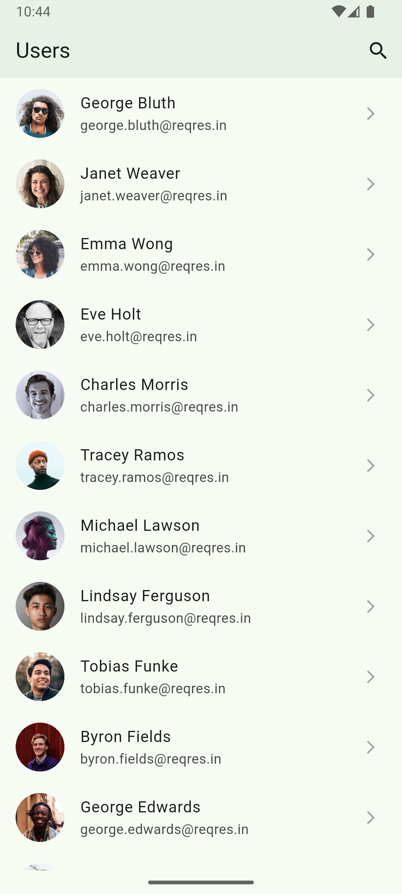
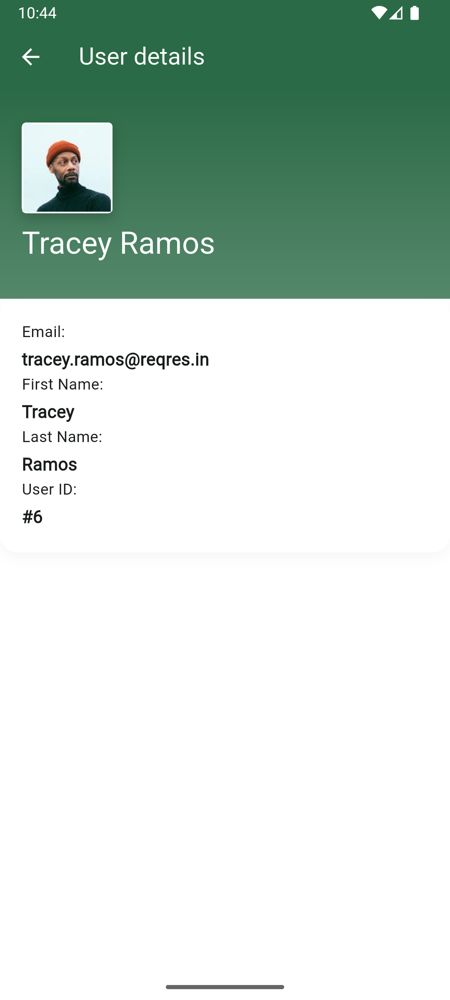

# Sokrio Users

A Flutter application demonstrating Clean Architecture, BLoC state management, and API integration.

## Features

- User list with infinite scrolling pagination
- User detail screen with complete information
- Search functionality (local filtering)
- Pull to refresh
- Offline caching with Hive
- Error handling and retry mechanism
- Clean Architecture with separation of concerns
- BLoC pattern for state management

## Screenshots

| User List Screen                      | User Details Screen                          |
|---------------------------------------|----------------------------------------------|
|  |  |

